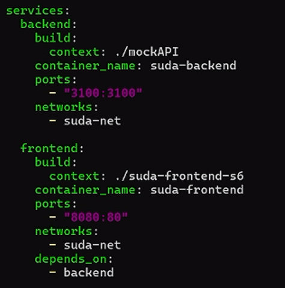

# Dockerización del Frontend y Backend de la aplicación (React + API)

## 1. Título  
**Dockerización del Frontend y Backend de la aplicación (React + API)**

## 2. Tiempo de duración  
**90 minutos**

## 3. Fundamentos

En esta práctica se tiene como objetivo dockerizar una aplicación frontend desarrollada con React, y un backend basado en Node.js. Para lograr esto, se construyó una imagen Docker tanto para el frontend como para el backend. El contenedor de frontend contiene la aplicación React, mientras que el backend ejecuta una API simulada. La interacción entre los contenedores se logra mediante una red Docker personalizada que conecta ambos servicios.

### Comandos utilizados

- `docker build`: Para construir imágenes Docker a partir de los Dockerfiles.
- `docker run`: Para ejecutar contenedores a partir de las imágenes.
- `docker network create`: Para crear redes personalizadas.
- `docker-compose`: Para orquestar contenedores de manera sencilla.

## 4. Conocimientos previos

- Conocimiento básico de Docker (contenedores, redes).
- Familiaridad con aplicaciones basadas en React y Node.js.
- Fundamentos de API REST y cómo se consumen desde el frontend.

## 5. Objetivos a alcanzar

- Crear una red Docker personalizada para conectar los contenedores de frontend y backend.
- Crear un contenedor para el backend que ejecute una API.
- Crear un contenedor para el frontend desarrollado en React.
- Configurar la comunicación entre ambos contenedores.

## 6. Equipo necesario

- Computadora con Docker y WSL habilitado.
- Navegador web.
- Terminal compatible con Docker CLI.
- Conexión a Internet para descargar las imágenes oficiales.

## 7. Material de apoyo

- [Documentación oficial de Docker](https://docs.docker.com/)
- [React Docs](https://reactjs.org/docs/getting-started.html)
- [Node.js Docs](https://nodejs.org/en/docs/)

## 8. Procedimiento

### Paso 1: Crear Dockerfile para el frontend (React)

El primer paso es crear un archivo Dockerfile en el directorio del proyecto de React:

```dockerfile
# Etapa 1: Build de React
FROM node:18 AS build
WORKDIR /app
COPY . .
RUN npm install
RUN npm run build

# Etapa 2: Servir con Nginx
FROM nginx:alpine
COPY --from=build /app/build /usr/share/nginx/html
EXPOSE 80
CMD ["nginx", "-g", "daemon off;"]
```

<p align="center">
  
</p>

### Paso 2: Crear Dockerfile para el backend

Ahora, se debe crear el Dockerfile para el backend (Node.js). Este archivo se ubicará en el directorio correspondiente al API:

```dockerfile
FROM node:18

WORKDIR /app

COPY . .

RUN npm install

EXPOSE 3100

CMD ["npm", "start"]
```

<p align="center">
  
</p>

### Paso 3: Crear una red personalizada en Docker

Ahora, vamos a crear una red Docker para que los contenedores puedan comunicarse entre sí:


<p align="center">
  
</p>

### Paso 4: Construir las imágenes de Docker

Usando los Dockerfiles, vamos a construir las imágenes para el frontend y el backend. En cada uno de los directorios, ejecutamos:


<p align="center">
  
</p>

### Paso 5: Ejecutar los contenedores

Ejecutamos el archivo compose:

```bash
docker-compose up --build
```

<p align="center">
  
</p>

### Paso 6: Verificar funcionamiento

1. Para verificar el frontend, abrimos el navegador y accedemos a `http://localhost`.
2. Para verificar el backend, accedemos a `http://localhost:3100` desde el navegador o mediante herramientas como Postman.

<p align="center">
  
</p>
<p align="center">
  
</p>
<p align="center">
  
</p>

## 9. Resultados

Ambos contenedores, frontend y backend, se ejecutaron correctamente. La red personalizada permitió la comunicación fluida entre ambos contenedores sin necesidad de exponer puertos innecesarios.

El frontend de la aplicación React fue accesible en `http://localhost`, y el backend simulado en `http://localhost:3100`. Ambos servicios interactuaron correctamente, como se esperaba.

<p align="center">
  
</p>

## 10. Conclusiones

Esta práctica permitió comprender cómo dockerizar tanto un frontend como un backend de una aplicación. El uso de redes personalizadas en Docker fue esencial para asegurar la comunicación entre los contenedores sin exponer puertos innecesarios. Además, la utilización de Docker para contenerizar la aplicación React y el backend basado en Node.js ofrece una solución escalable y eficiente para entornos de desarrollo y producción.

## 11. Bibliografía

Docker. (2024). *Docker Docs*. https://docs.docker.com/

React. (2024). *React Documentation*. https://reactjs.org/docs/getting-started.html

Node.js. (2024). *Node.js Documentation*. https://nodejs.org/en/docs/
